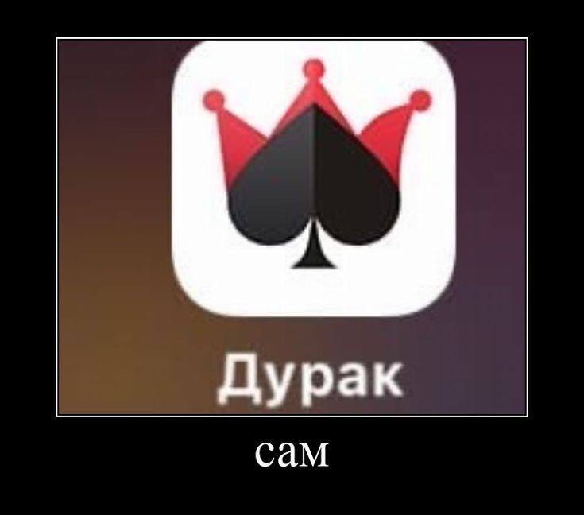

[Uploading finalproje<!DOCTYPE html>
<html lang="ru">
  <head>
    <meta charset="UTF-8" />
    <meta name="viewport" content="width=device-width, initial-scale=1.0" />
    <title> Курсы по игре "Дурак Онлайн"</title>
    <link
      rel="stylesheet"
      href="index.css"
    />
    <link rel="icon" href="https://sun9-22.userapi.com/impg/-N2sPV4fc9hhnQOzFlFn590MZSg440e4BfamXQ/cgOoIz4E0GQ.jpg?size=284x286&quality=96&sign=9375de67cb34cadcabcb357040ddad58&type=album" />
  </head>
  <body>
    <header id = "#header" class="header">
      

        <h1 id = "up" class="header-title">Дурак Онлайн</h1>
      

    </header>
    <header class = "second-header"> 
        

            <h1 class = "second-header-title"> Каждый знает, как играть, но не каждый - как выигрывать</h1>
        

    </header>
    <header class = "navigation"> 
            <nav > 
                <ul>
                    <li> <a href = "index.html#header" target = "_self"> <u>Главная</u></a></li>
                    <li> <a href = "index2.html">О курсе</a></li>
                    <li> <a href = "index3.html">Тест на дурака</a></li>
                    <li> <a href = "passport.html">Паспорт</a></li>
                    <li> <a href = "index4.html">Записаться на курс</a></li>

                </ul>
                
            </nav>
    
    </header>

    <header class = "page-navigation">
      <nav>
        <ul>
         <li> <a href = '#hystory'> История игры </a> </li>
         <li>  </li>
         <li> <a href = '#cooperation'> Сотрудничество </a> </li>
        </ul>

      </nav>
    </header>
    
    <section class="content">
      

        
        <h3 class="card-title">Развлечение</h3>
        
Игра в «дурака» — отличный способ развлечься, 
          она позволяет расслабиться и отвлечься от повседневных забот. 
        

      

      

        
        <h3 class="card-title">Социальная активность</h3>
        

           Вы можете играть вместе с друзьями и обмениваться шутками во время игры.
        

      

      

        
        <h3 class="card-title">Поддержание традиций</h3>
        

          Для многих игра в «дурака» является частью культурной традиции, 
          передающейся из поколения в поколение. 
        

      

      

        
        <h3 class="card-title">Психологическая разгрузка</h3>
        

          Процесс игры позволяет отвлечься от ежедневных забот и стрессов, 
          что способствует улучшению настроения и общего самочувствия.
        

      

    </section>

    <section>
       

         <h3 class = "card-title"> История игры в дурачка</h3>
           
 Игра в дурака прошла длительный путь от традиционной настольной игры до популярной онлайн-версии. 
        С развитием технологий и интернета, «дурак» адаптировался и продолжает привлекать игроков, сохраняя 
        свою популярность и сегодня. Благодаря многогранности и доступности онлайн-игр «дурак» остаётся любимым 
        развлечением для миллионов людей, объединяя их в сообщества и даря радость коллективного времяпрепровождения.

        
      

      

        <h3 class = "card-title"> Мобильное приложение в разработке....</h3>
        
      

    </section>

    
 
      <h5 class = "up-text"><a href = "#up"> Наверх</a></h5>
    

    
    

    <footer class="footer">
      <h4 id = "cooperation" class="footer-author">
        Дях х Дурак Онлайн
      </h4>
    </footer>
    <footer class = "minifooter">
      <h4 class = "footer-cooperation">По вопросам сотрудничества: <a href = "https://t.me/luarsiiee" target = "_blank">@luarsiiee </a></h4>
    </footer>
  </body>
</html>ctdurakonline.html…]()
